# Entorno de Desarrollo - Seminario Laravel con Enfoque RAD

Repositorio de configuración inicial para el **Seminario Desarrollo de Aplicaciones Web en Laravel con Enfoque RAD**.

Este entorno fue configurado con **Ubuntu WSL**, **Docker Desktop**, **Docker Compose**, **Git** y **GitHub**. Permite ejecutar una aplicación PHP con Apache, una base de datos MariaDB y phpMyAdmin.

## Estudiante

**Gustavo Adolfo Piedrahita**

Repositorio público:

https://github.com/Gustavo-87/entorno-seminario-laravel

## Requisitos

* Ubuntu WSL
* Docker Desktop con integración WSL activa
* Git
* Docker Compose

Versiones verificadas:

* Docker version 29.5.2
* Git version 2.43.0
* Docker Compose version v5.1.3

## Estructura del proyecto

```text
entorno-seminario-laravel/
├── docker-compose.yml
├── Dockerfile
├── README.md
├── src/
│   └── index.php
└── evidencias/
    ├── Captura CONTENEDORES.png
    ├── Captura PHP INF).png
    └── Captura PHPMYADMIN.png
```

## Servicios configurados

| Servicio     | Contenedor           | Puerto |
| ------------ | -------------------- | ------ |
| PHP / Apache | seminario_php        | 8082   |
| phpMyAdmin   | seminario_phpmyadmin | 8083   |
| MariaDB      | seminario_mariadb    | 3307   |

Los puertos fueron modificados para evitar conflictos con otros proyectos trabajados durante el semestre.

## Clonar el repositorio

```bash
git clone https://github.com/Gustavo-87/entorno-seminario-laravel.git
cd entorno-seminario-laravel
```

## Levantar el entorno

```bash
docker compose up -d
```

## Verificar contenedores

```bash
docker ps
```

Deben aparecer activos:

* seminario_php
* seminario_phpmyadmin
* seminario_mariadb

## Acceso a PHP / Apache

Abrir en el navegador:

http://localhost:8082

Debe mostrarse la página de `phpinfo()`.

## Acceso a phpMyAdmin

Abrir en el navegador:

http://localhost:8083

Datos de conexión:

* Servidor: db
* Usuario: root
* Contraseña: root_password
* Base de datos: seminario_db

## Base de datos

Datos principales:

* Host interno Docker: db
* Puerto interno Docker: 3306
* Puerto local: 3307
* Base de datos: seminario_db
* Usuario root: root
* Contraseña root: root_password
* Usuario desarrollo: dev_user
* Contraseña desarrollo: dev_password

## Evidencias

### Contenedores activos

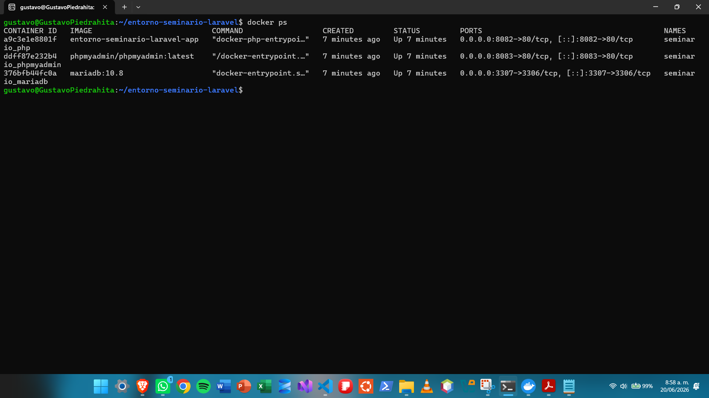

### PHP funcionando con phpinfo()

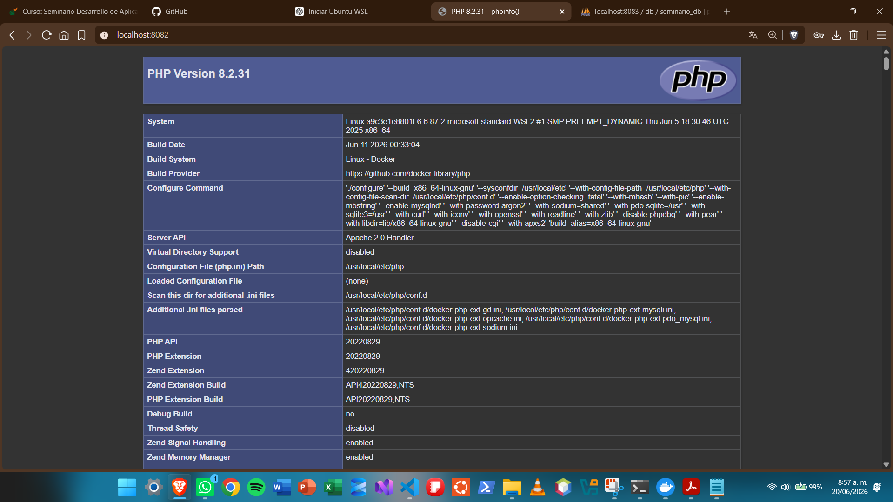

### phpMyAdmin funcionando

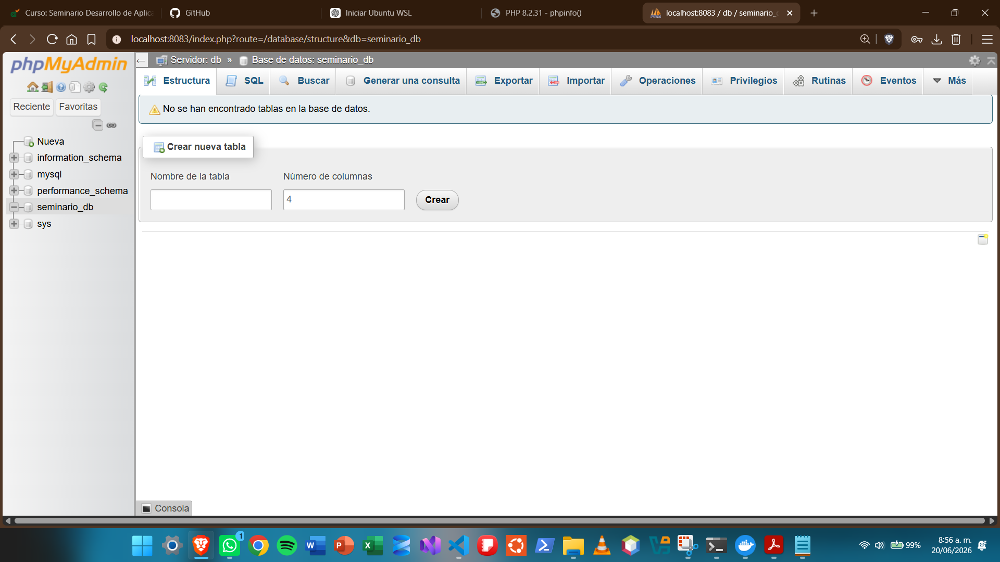

## Comandos útiles

Detener contenedores:

```bash
docker compose down
```

Levantar contenedores:

```bash
docker compose up -d
```

Reconstruir contenedores:

```bash
docker compose up -d --build
```

Ver estado:

```bash
docker compose ps
```

Ver logs:

```bash
docker compose logs
```

## Entrega

El repositorio fue publicado en GitHub con visibilidad pública. También se agregó al docente como colaborador, cumpliendo con lo solicitado en la guía del seminario.

## Conclusión

Se configuró correctamente el entorno inicial de desarrollo. Se verificó Docker, Git y Docker Compose; se levantaron los contenedores de PHP, MariaDB y phpMyAdmin; se ajustaron los puertos para evitar conflictos; se agregaron evidencias de funcionamiento y se publicó el repositorio en GitHub.

## Guía 2 - Introducción a PHP

En esta guía se desarrollaron ejercicios básicos de PHP dentro del entorno Docker configurado para el seminario de Laravel.

### Actividad 1: Variables y Strings

Se modificó el archivo `src/index.php` agregando las variables `$semestre` y `$materiaFavorita`, mostrando el mensaje solicitado en el navegador.

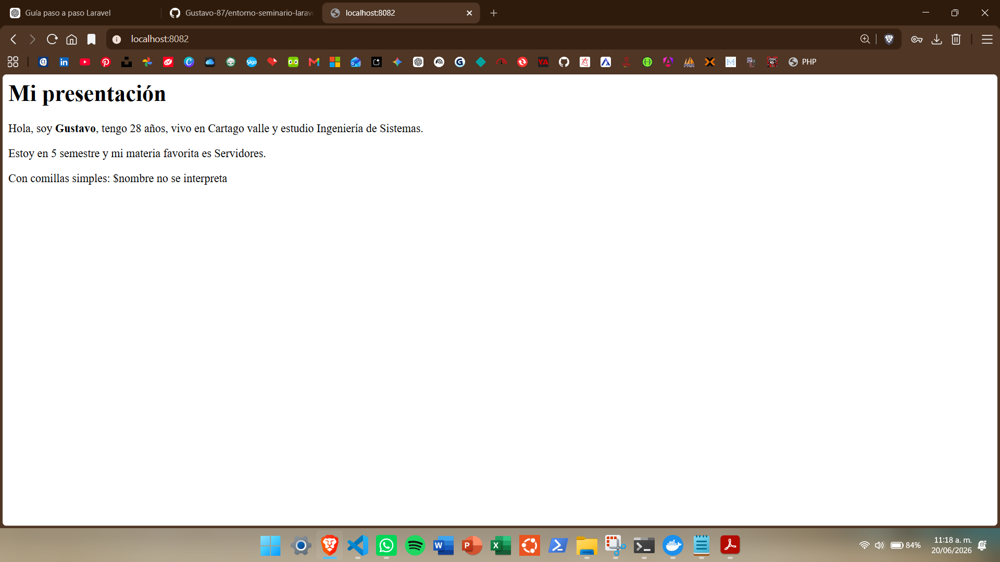

### Actividad 2: Arrays y Bucles

Se creó el archivo `src/array_demo.php`, donde se trabajó con arrays asociativos, recorrido con `foreach`, cálculo de total y cálculo de IVA del 19%.

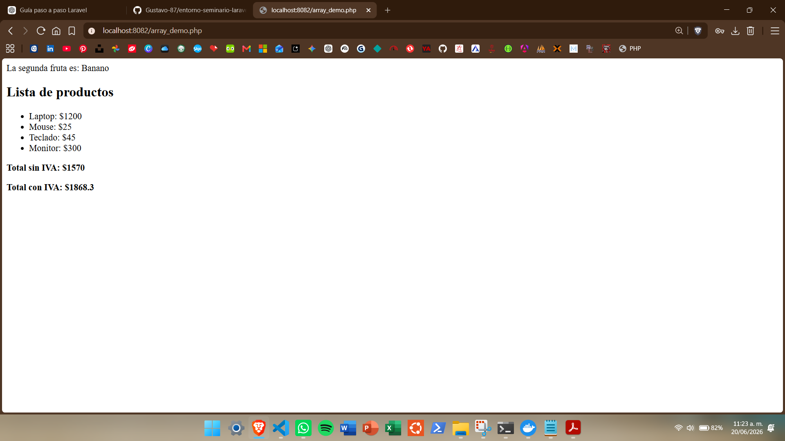

### Actividad 3: Condicionales y Funciones

Se creó el archivo `src/funciones.php`, incluyendo la función `esMayorDeEdad($edad)` y el recorrido de un array de edades para determinar si cada persona es mayor o menor de edad.

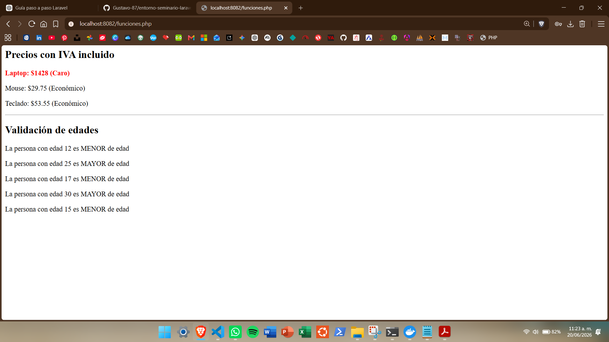

### Archivos desarrollados

* `src/index.php`
* `src/array_demo.php`
* `src/funciones.php`

### Actividad 4: Formularios GET y POST

Se creó el archivo `src/formulario.php`, implementando un formulario con método `POST`. El formulario captura nombre, correo electrónico y teléfono. Además, se agregó la validación para verificar que el teléfono no esté vacío y que sea numérico usando `is_numeric()`.

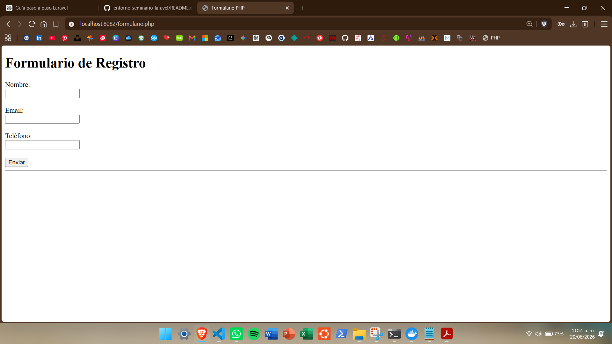

### Actividad 5: Programación Orientada a Objetos - POO

Se creó la carpeta `src/POO/` y dentro de ella el archivo `Producto.php`, donde se implementó una clase llamada `Producto`.

La clase incluye atributos privados como nombre, precio, IVA y categoría. También se agregó el método `getCategoria()` y se modificó el método `getInfo()` para mostrar la categoría del producto junto con su precio final.

En el archivo `src/index.php` se instanciaron varios objetos de la clase `Producto`, usando categorías como "Electrónica" y "Oficina".

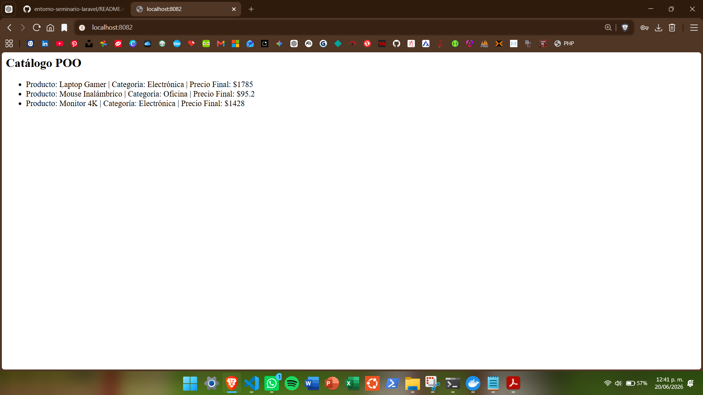

### Actividad 6: Diseño de Base de Datos y SQL

En esta actividad se diseñó una base de datos relacional para manejar usuarios, publicaciones y categorías.

Se crearon las siguientes tablas:

* `users`: almacena los usuarios del sistema.
* `categorias`: almacena las categorías disponibles para clasificar publicaciones.
* `posts`: almacena las publicaciones y se relaciona con usuarios y categorías.

#### SQL utilizado

```sql
USE seminario_db;

DROP TABLE IF EXISTS posts;
DROP TABLE IF EXISTS categorias;
DROP TABLE IF EXISTS users;

CREATE TABLE users (
    id INT AUTO_INCREMENT PRIMARY KEY,
    nombre VARCHAR(100) NOT NULL,
    email VARCHAR(100) UNIQUE NOT NULL
);

CREATE TABLE categorias (
    id INT AUTO_INCREMENT PRIMARY KEY,
    nombre VARCHAR(100) NOT NULL
);

CREATE TABLE posts (
    id INT AUTO_INCREMENT PRIMARY KEY,
    titulo VARCHAR(200) NOT NULL,
    contenido TEXT,
    user_id INT NOT NULL,
    categoria_id INT NOT NULL,
    FOREIGN KEY (user_id) REFERENCES users(id) ON DELETE CASCADE,
    FOREIGN KEY (categoria_id) REFERENCES categorias(id)
);

INSERT INTO users (nombre, email) VALUES
('Carlos Pérez', 'carlos@mail.com'),
('María Gómez', 'maria@mail.com');

INSERT INTO categorias (nombre) VALUES
('Tecnología'),
('Deportes');

INSERT INTO posts (titulo, contenido, user_id, categoria_id) VALUES
('Mi primer post', 'Contenido del post 1', 1, 1),
('Segundo post', 'Contenido del post 2', 1, 2),
('Post de María', 'Hola mundo', 2, 1);
```

#### Relación entre tablas

La tabla `users` se relaciona con la tabla `posts` mediante el campo `user_id`.

Esto significa que un usuario puede tener muchas publicaciones, pero cada publicación pertenece a un solo usuario.

Relación:

```text
users.id  →  posts.user_id
```

La tabla `categorias` se relaciona con la tabla `posts` mediante el campo `categoria_id`.

Esto significa que una categoría puede estar asociada a muchas publicaciones, pero cada publicación pertenece a una sola categoría.

Relación:

```text
categorias.id  →  posts.categoria_id
```

### Actividad 7: Conexión PDO con Patrón Singleton

En esta actividad se implementó la conexión a la base de datos usando **PDO** y el patrón **Singleton**, con el objetivo de mantener una única instancia de conexión durante la ejecución de la aplicación.

Se creó la carpeta `src/config/` y dentro de ella el archivo `Database.php`, encargado de centralizar la conexión con la base de datos `seminario_db`.

También se creó el archivo `src/test_db.php`, el cual permite probar la conexión y listar los usuarios almacenados en la tabla `users`.

#### Archivos desarrollados

* `src/config/Database.php`
* `src/test_db.php`

#### Evidencia de funcionamiento

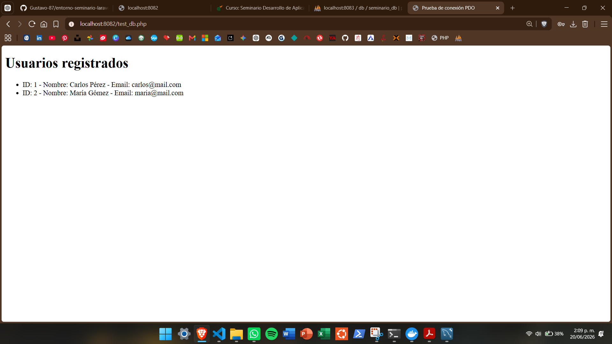

### Actividad 8: Creación del Modelo con CRUD

En esta actividad se creó el modelo `UserModel`, encargado de manejar operaciones básicas sobre la tabla `users`.

El modelo permite:

* Listar todos los usuarios registrados.
* Obtener un usuario por su ID.
* Crear un nuevo usuario usando el método `create()`.

Se creó la carpeta `src/models/` y dentro de ella el archivo `UserModel.php`. También se creó el archivo `src/test_model.php` para probar el funcionamiento del modelo desde el navegador.

#### Archivos desarrollados

* `src/models/UserModel.php`
* `src/test_model.php`

#### Evidencia de funcionamiento

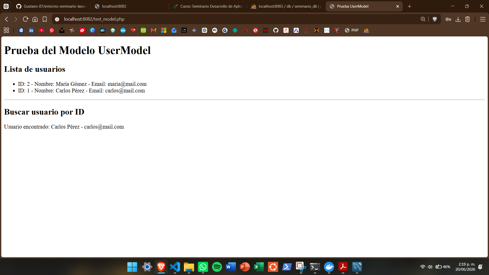

### Actividad 9: Prueba de conexión PDO con la base de datos

En esta actividad se creó el archivo `src/test_db.php` para probar la conexión a la base de datos usando PDO.

El archivo utiliza la clase `Database.php`, ubicada en `src/config/`, para conectarse a la base de datos `seminario_db` y consultar los usuarios registrados en la tabla `users`.

#### Código utilizado

```php
<?php
require_once 'config/Database.php';

$db = Database::getInstance()->getConnection();
$stmt = $db->query("SELECT * FROM users");

echo "<h2>Usuarios desde PDO</h2>";

while ($row = $stmt->fetch(PDO::FETCH_ASSOC)) {
    echo "ID: {$row['id']} - Nombre: {$row['nombre']} - Email: {$row['email']}<br>";
}
?>
```

#### Resultado

Al acceder desde el navegador a:

```text
http://localhost:8082/test_db.php
```

se muestra la lista de usuarios almacenados en la base de datos.

#### Evidencia de funcionamiento

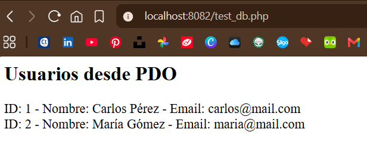

### Bloque 10: Vistas y entrega final

En este bloque se implementaron las vistas de la aplicación para listar y crear usuarios, aplicando una estructura básica tipo MVC.

Se creó la carpeta:

```text
src/views/users/
```

Dentro de esta carpeta se agregaron las siguientes vistas:

- `index.php`: muestra la lista de usuarios registrados en una tabla.
- `create.php`: muestra el formulario para crear un nuevo usuario.

También se creó el controlador:

```text
src/controllers/UserController.php
```

Este controlador se encarga de recibir las acciones del usuario y comunicarse con el modelo `UserModel`.

El archivo principal:

```text
src/index.php
```

funciona como Front Controller, es decir, recibe la acción por la URL y decide qué método ejecutar.

#### Acciones implementadas

```text
index  → lista los usuarios
create → muestra el formulario y guarda nuevos usuarios
delete → elimina usuarios
```

#### Estructura MVC construida

```text
Modelo:
src/models/UserModel.php

Controlador:
src/controllers/UserController.php

Vistas:
src/views/users/index.php
src/views/users/create.php

Entrada principal:
src/index.php
```

#### Funcionamiento

Al ingresar a:

```text
http://localhost:8082/index.php
```

se muestra la lista de usuarios con Bootstrap.

Desde allí se puede:

- Crear un nuevo usuario.
- Ver el mensaje `Usuario creado exitosamente`.
- Eliminar usuarios registrados.

#### Evidencia de funcionamiento

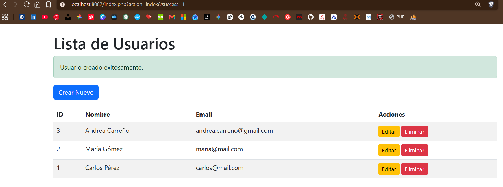

## Instalación de Laravel - Semana 2

En esta sección se documenta la instalación y ejecución inicial del proyecto Laravel correspondiente a la Semana 2.

El objetivo fue verificar que el entorno estuviera correctamente configurado con PHP, Composer y Laravel, además de comprobar que el proyecto se ejecutara correctamente en el navegador.

### 1. Verificación de PHP y Composer

Se validó la instalación de PHP y Composer desde la terminal ejecutando los siguientes comandos:

```bash
php -v
composer --version
```

Estos comandos permiten comprobar que el entorno cuenta con las herramientas necesarias para instalar y ejecutar un proyecto Laravel.

**Evidencia:**

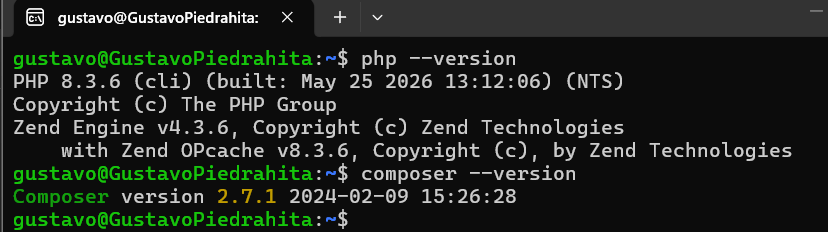

### 2. Estructura del proyecto Laravel

Luego de crear el proyecto Laravel, se revisó la estructura de archivos y carpetas mediante el comando:

```bash
ls -la
```

Con este comando se verificó que el proyecto contiene la estructura base de Laravel, incluyendo carpetas como:

```text
app/
bootstrap/
config/
database/
public/
resources/
routes/
storage/
tests/
```

También se identifican archivos importantes como:

```text
artisan
composer.json
package.json
README.md
```

**Evidencia:**

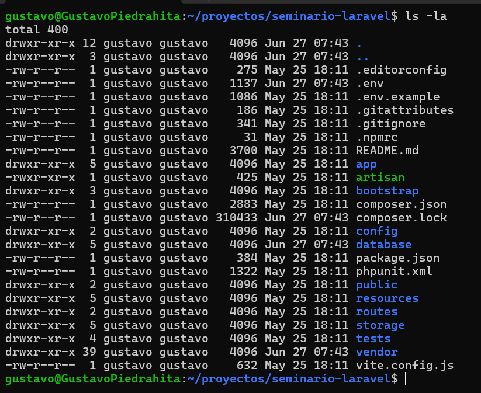

### 3. Ejecución del proyecto Laravel

Finalmente, se ejecutó el proyecto Laravel y se verificó en el navegador que cargara correctamente la pantalla de bienvenida.

El proyecto se ejecutó localmente y se accedió desde el navegador mediante la URL correspondiente al entorno configurado, por ejemplo:

```text
http://localhost:8000
```

**Evidencia:**


### 4. Archivos excluidos del repositorio

Para evitar subir archivos innecesarios o sensibles al repositorio, se mantiene configurado el archivo `.gitignore`.

No se debe subir la carpeta:

```text
vendor/
```

Tampoco se debe subir el archivo:

```text
.env
```

La carpeta `vendor/` se puede reconstruir ejecutando:

```bash
composer install
```

El archivo `.env` contiene configuraciones sensibles del entorno local, por lo tanto no debe publicarse en GitHub.

### 5. Entregable

El entregable de esta actividad incluye:

- Carpeta `Semana2/` con el proyecto Laravel.
- Captura de `php -v` y `composer --version`.
- Captura de `ls -la` mostrando la estructura del proyecto.
- Captura de la pantalla de bienvenida de Laravel en el navegador.
- Archivo `README.md` actualizado con la sección **Instalación de Laravel**.
- Proyecto Laravel subido al repositorio sin incluir `vendor/` ni `.env`.


